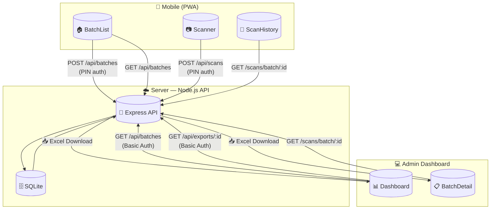
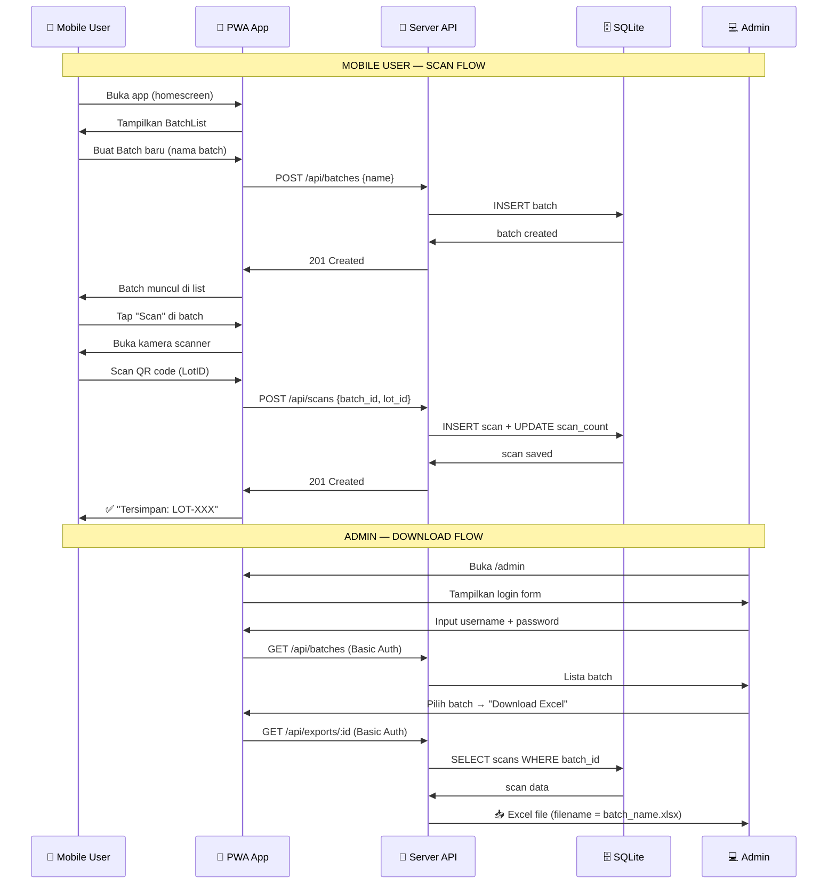
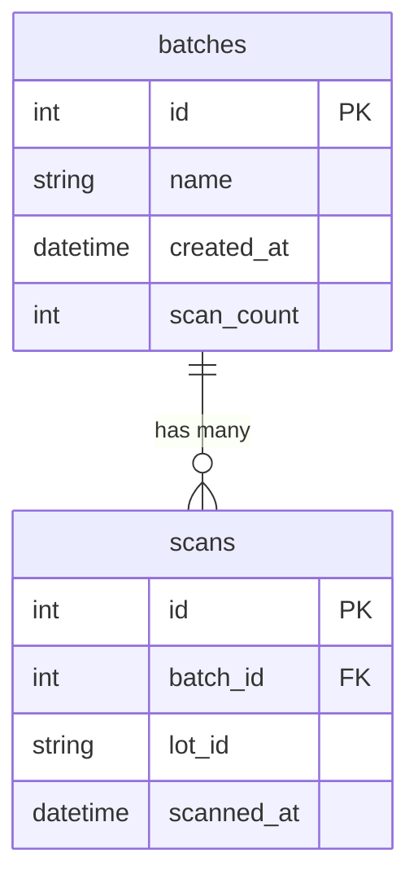

# QR Batch Scanner — Documentation

**Project:** https://github.com/andrizpray/qr-batch-scanner  
**Tanggal:** 2026-07-12

---

## 📊 System Architecture



---

## 🔄 User Flow



---

## 🗄️ Data Model



---

## 🌐 API Endpoints

| Method | Endpoint | Auth | Description |
|--------|----------|------|-------------|
| `POST` | `/api/batches` | X-PIN (mobile) | Create new batch |
| `GET` | `/api/batches` | Basic Auth (admin) | List all batches |
| `GET` | `/api/batches/:id` | Basic Auth (admin) | Get batch detail |
| `PUT` | `/api/batches/:id` | Basic Auth (admin) | Update batch name |
| `DELETE` | `/api/batches/:id` | Basic Auth (admin) | Delete batch + scans |
| `POST` | `/api/scans` | X-PIN (mobile) | Add scan to batch |
| `GET` | `/api/scans/batch/:batch_id` | Basic Auth (admin) | Get scans in batch |
| `GET` | `/api/exports/:batchId` | Basic Auth (admin) | Download Excel (batch) |
| `GET` | `/api/exports/all` | Basic Auth (admin) | Download Excel (all) |

---

## 🔐 Authentication

### Mobile (PWA)
- **Method:** X-PIN header
- **Default PIN:** `1234`
- **Usage:** Set PIN di app mobile, disimpan di localStorage

### Admin Dashboard
- **Method:** HTTP Basic Authentication
- **Default:** `admin` / `admin123`
- **Usage:** Login form di `/admin`

---

## 📁 Project Structure

```
qr-batch-scanner/
├── server/
│   ├── index.js           # Express app entry
│   ├── db.js              # SQLite init + migrations
│   ├── .env               # Environment variables
│   ├── .env.example       # Env template
│   ├── routes/
│   │   ├── batches.js     # Batches CRUD
│   │   ├── scans.js       # Scans endpoints
│   │   └── exports.js     # Excel export
│   └── middleware/
│       └── auth.js        # PIN + Basic Auth
├── client/
│   ├── src/
│   │   ├── views/
│   │   │   ├── Mobile/
│   │   │   │   ├── BatchList.vue
│   │   │   │   ├── Scanner.vue
│   │   │   │   └── ScanHistory.vue
│   │   │   └── Admin/
│   │   │       ├── Dashboard.vue
│   │   │       └── BatchDetail.vue
│   │   ├── router/
│   │   │   └── index.ts
│   │   └── composables/
│   │       └── useApi.ts
│   ├── dist/              # Production build
│   └── public/            # PWA icons
├── docs/
│   └── diagrams.md        # This file
└── README.md               # Deployment guide
```

---

## 🚀 Deployment

### Quick Deploy (VPS)

```bash
# 1. Clone & install
git clone https://github.com/andrizpray/qr-batch-scanner.git
cd qr-batch-scanner
npm install

# 2. Setup env
cp server/.env.example server/.env
nano server/.env  # edit PIN & passwords

# 3. Build frontend
npm run build

# 4. Start with PM2
pm2 start server/index.js --name qr-scanner-server
pm2 startup  # auto-start on reboot
pm2 save     # save current state
```

### Nginx (Subdomain)

```nginx
server {
    listen 80;
    server_name scan.yourdomain.com;

    root /path/to/qr-batch-scanner/client/dist;
    index index.html;

    location / {
        try_files $uri $uri/ /index.html;
    }

    location /api {
        proxy_pass http://127.0.0.1:3000;
        proxy_http_version 1.1;
        proxy_set_header Host $host;
        proxy_set_header X-Real-IP $remote_addr;
    }
}
```

### Nginx (Subdirectory)

```nginx
location /scan {
    alias /path/to/qr-batch-scanner/client/dist;
    try_files $uri $uri/ /scan/index.html;
}

location /scan/api {
    proxy_pass http://127.0.0.1:3000;
}
```
